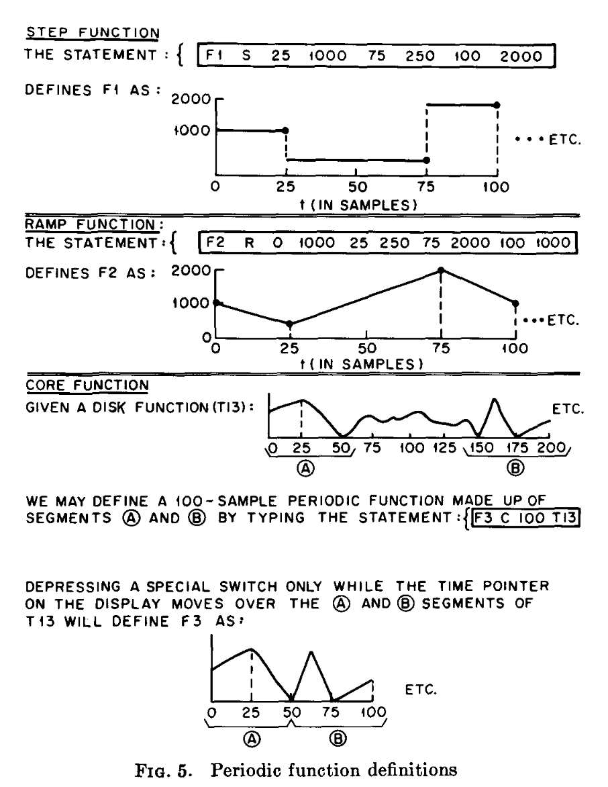

#computermusic

"GROOVE—a program to compose, store, and edit functions of time" (1970)

https://dl.acm.org/doi/10.1145/362814.362817

[[Max Mathews]]によるリアルタイム信号制御装置。

専用のコントローラーを使ってジェスチャーを元に波形を記録した上で、専用の言語でそれを加工したりモジュレーションしたりして、DACを通してモジュラーシンセの制御信号として使用したりする。

オーディオレートには非対応。

