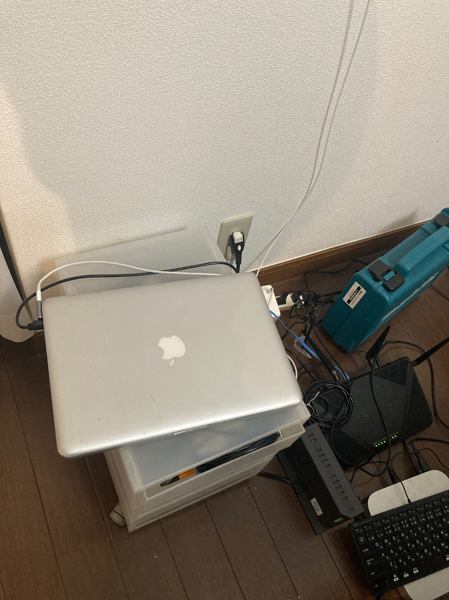
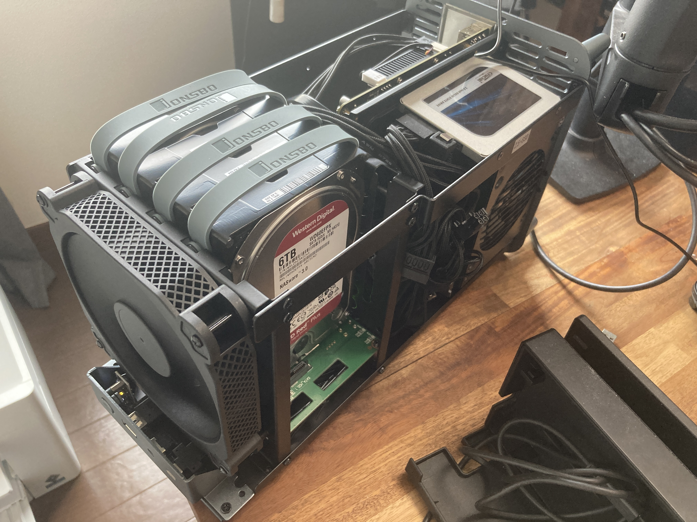
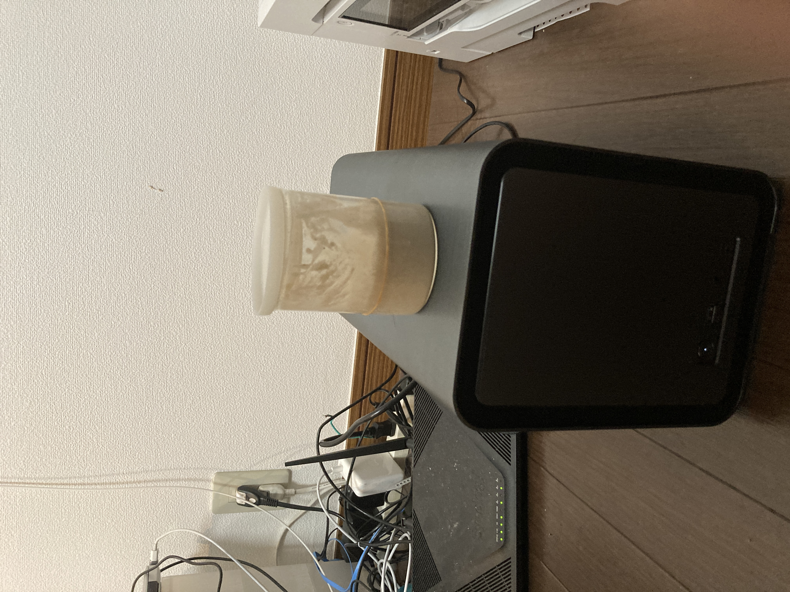

## 物理構成

### Macbook Pro (mid 2012)

SSD(256GB)に載せ替え、メモリ16GB

接続は有線、電源はMagsafe-USB typeC変換アダプタにしてMacbook Pro 2019のアダプタをもらってきている

### NAS

- ケース：JONSBO N1
	- フロントの14cmケースファンはうるさかったのでKAZE FLEX 140 SQUARE PWM 1200rpmに交換（CPUファンのPWMを分岐した）
- [アリエクで買える謎のNAS用Mini-ITXマザー](https://ja.aliexpress.com/item/1005005293008975.html)
	- CPUはオンボードJ6413
	- SATAx6
	- なぜか2.5GbEが3つもついてる
	- フロントパネルはUSB変換かまして2.0でしか使えない（オーディオ用のヘッダは無い）
- メモリ DDR4 8GB(マザボの限界)
- ストレージ
	- CrucialのなんかSSD 256GB(ブート用)
	- WD Red Pro 6TB x4 ZFSでRAIDZ2(RAID6相当)組んでるので実用量は10TBくらい
	- WD Blue 4TB x1 (前使ってた外付けHDDからデータを移し終わったので挿してるけど、未使用)
- Corsair SF450 -PLATINUM
	- 低負荷だとファン停止して動いてくれるのが嬉しい（今の所回ってるの見たことない）

今の所熱は夏冷房かけずに外出してもなんとか大丈夫そう

酵母のスターターを膨らませるのにも便利

## 論理構成

どちらもベアメタルにインストールされてるのは[[Proxmox]]

NASはSSD上にボリューム作って[[TrueNAS]] Coreを立ち上げ、NFSサーバーとして仮想マシン用のボリュームを提供している

[[TrueNAS]]は普通にScaleの方でよかったと思う、よくわかってなかったので・・・GUIでアップグレードできるのでそのうち上げる

### 仮想マシン（というかLXC）

Docker用にLXCコンテナが計3つぐらい動いてる

Proxmoxの性質上、どうしてもDockerコンテナをいっぱい立ち上げたければそのホストになるVMかLXCを立てる必要がある。

いっぱいいるけど全部[[Portainer]]で一覧してWebから管理はできている

#### MBP-Dockerホスト1(Mastodon)

[[Mastodon]]とそのリバースプロキシ関連が立ち上がってる。わざわざマシン分けた意味はあんまりない気がする

#### MBP-Dockerホスト2
